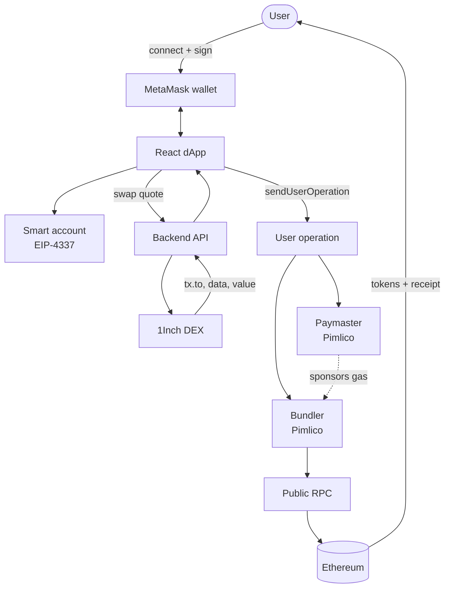

# Gasless swaps ETH-ERC20

> This project is a walktrough on how sponsored transactions (EIP-2711) work in Ethereum L2 chains by optimizing user experience to the minimum feacible operation  

## Introduction

    The objective is to build a "gasless" swap exchange for cryptocurrencies. The user connect their own wallet, select one coin that they own and by signing a single transaction, they can exchange the coins, receive the funds into their wallet without paying the gas fee for such operation.

    I will explain the theory behind it, provide a solution, a demo and how to run the project locally.


> There is not such a thing as "gassless", it is just paid by someone else. There is not such thing as "free stuff" in any real economic system that works and lasts trough time.

## Gassles 1 click swap

    The solution mixes a few sophisticated tools to make this possible. I stick to technology that is already mature enough to avoid going insane debuging weird things I don't know enough of. The goal here is to get a MVP up and running in a real case scenario. Skin in the game.

    One thing about these type of apps is that they run on the client side, so the client never sends anyhing to a server, this works as an extra security measure and as a simplification for a lot of things. 

    We use:

- **React**: The default current web development ecosystem, I used vite and I generated the UI with lovable. Design is not my strength really (but i admire designers).

- **Gas**: Tokens needed to process a transaction

- **EIP-**: The mechanism that allows another party to pay for the gas of a transaction

- **smart-account**: Mechanism that allows to sign transactions without exposing the whole wallet

- **web3 library**: A library that provide lots of quality of life functions for integrating with webr

- **metamask**: A wallet that i use a lot 

### Architectural diagram

### How it works

1. The user connect their wallet to the dApp

2. The user selects the coin that wants to exchange
   
   1. It should have the original coin funds available

3. The dApp gets the swap quotes from 1inch

4. The dApp builds the User Operation with the Pimlico paymaster

5. The user signs the transaction (approves it).

6. The dApps sends the transaction for execution

7. The paymaster pays for the gas and pays itself 

8. The  transaction gets executed



### dApp - Connecting the wallet

    First thing first, we need to somehow create a bridge between our wallet into the browser, so we can interact with the dApp. For that, we use[ **wagmi** js library ](https://wagmi.sh/) which provides lots of primitives to easily interact with wallets providers as MetaMask. 


    These functions allow us to interact with the wallet trough the browser:

```javascript
const { connectors, connect } = useConnect()
```

    Then we check if we have a previously connected wallet, if not, we pick up the first one from the connectors array (you would need to allow the user select the wallet they want to use otherwise).

```javascript
if (!isConnected) {
    // Show connecting modal and connect wallet
    setShowConnectingWallet(true);
    setPendingSwapAfterConnect(true);

    const connector = connectors[0]; // Picks the first wallet
    if (connector) {
        await connect({ connector });
    }
}
```

    Once connected, we have now bridged the wallet and the browser together.

### Gasless - Gas sponsorship

    For gas sponsorhip, someone is going to pay for the gas (the dApp owner usually). In this case we will use [Pimlico](https://docs.pimlico.io/guides/getting-started) which give us the out of the box paymaster smart contract. Allowing us to load funds into the platform which are the ones used for the paying gas.


    After that we can just use the client as it is:

```javascript
const pimlicoUrl = `https://api.pimlico.io/v2/1/rpc?apikey=${import.meta.env.VITE_PIMLICO_API_KEY}`

const paymasterClient = createPimlicoClient(
    {
        transport: http(pimlicoUrl),
        entryPoint: {
          address: entryPoint07Address,
          version: "0.7",
        },
    }
);
```

> **NOTE** this shall run in a backend and not be exposed in the front end. Unless you want to give your API key to anyone to use :p

### RPC - Interacting with the Blockchain

    In order to produce real transactions, get blocks data, etc.  We will need to interact with a **public RPC node**, These nodes are servers that act as a bridge between dApps and the blockchain. Think about them as a REST API you can use. So we can submit transactions trough them.

    In this case we use [https://eth.blockrazor.xyz](https://eth.blockrazor.xyz) but there are a lot of them for free available in [ChainList](https://chainlist.org/chain/1).

```javascript
const publicClient = createPublicClient(
    {
        chain: mainnet,
        transport: http("https://eth.blockrazor.xyz"),
    }
);
```

### DEX - Getting the routing info

    In order to get Gas fee and the routing information for swapping between blockchains we need a service that tracks such information. For that we use a decentralized exchange DEx ([1Inch](https://1inch.com/) api) which does the job of finding the best candidate to swap tokens at the best fees.

    **Example:** We want to swap ETH for AAVE. When we execute the swap, the ETH is sent from wallet A to B in ethereum, and then wallet B sends funds to A in AAVE chain.

    As a response we receive the address which we need to send the funds to, the amount and the "data" object, which is the ABI encoded instructions (smart contract binary encoded instructions).

```javascript
export async function getSwapData(fromAddress: string,tokenSrc: string, tokenDst: string, amount: string, permit?: string): Promise<SwapDataResponse | null> {
    const url = `${import.meta.env.VITE_API_URL}/dex/swap`
    try {
        const response = await axios.post<SwapDataResponse>(url, {
            "from": fromAddress,
            "tokenSrc": tokenSrc,
            "tokenDst": tokenDst,
            "amount": Number(parseEther(amount, "gwei")),
            "chainId": 1, // ETH mainnet
            "permit": permit || null,
        })
        return response.data
    }  catch (error) {
        console.error("[swap] Error swapping:", error)
        return null
    }
}
```

### Smart account - EIP-4337

    When we talk about "gasless" transactions, we mentioned that someone else is actually paying for that. That is where Smart accounts become useful: If we used legacy wallets, when we create a transaction we would need to pay for the gas as part of the transaction and somehow receive those funds back. But with Smart Accounts we can add the gasless mechanism as part of it, making it easier.

    Smart accounts are actually a smart contract which has been derived and signed by the main wallet, it acts as a sub wallet that can be more flexible and run code inside. 

    First we define the Smart Account: 

- **public client**:  Where we read info from the blockchain

- **Implementation**: Wallet + optional passkeys (this is over powered i shall have used SingleDelegate)

- **Deploy params**: We define the Wallet that controls this smart account, the empty arrays are for pass keys.

- **Deploy salt**: This is use to derive accounts. It is used as a security mechanism 

- **Signer**: Who signs the user operation.

```javascript
const smartAccount = await toMetaMaskSmartAccount(
    {
        client: publicClient,
        implementation: Implementation.Hybrid,
        deployParams: [ownerAddress, [], [], []],
        deploySalt: "0x", // Default
        signer: { walletClient },
    }
)
```

> Docs: [Account abstraction | ethereum.org](https://ethereum.org/roadmap/account-abstraction/)

### L2 and User Operations

    In order to make swapping and sending transactions faster and cheaper, we use L2 chains. In L1 as ethereum, for each operation we need to send and execute a transaction per operation, this makes an operation to be expensive and slow. L2s solve it by aggregating them into user operations, and such operations are calculated off chain by the nodes, then a proof is submitted into the chain, making them faster and cheaper, essentially we are moving out of the chain the computing cost per operation.

    In order to execute a User Operation, We want to  "assemble" the smart contract. As you can see we define a few meta parameters on what the smart contract needs to operate with:

- **paymaster**: The smart contract that will be responsible of paying for the gas for the transaction.

- **bundler**: The bundler is the node that validates, aggregates our user operation with others into the transaction that will be executed on chain for us.

- **estimateFeesPerGas**: How much we want to pay for gas, since it is seted as fast, it will be more expensive but faster. Gas price is calculated based on the operation computation cost (bytes size)

```javascript
const smartAccountClient = createSmartAccountClient(
    {
        account: smartAccount,
        chain: mainnet,
        paymaster: paymasterClient,
        bundlerTransport: http(
          pimlicoUrl,
        ),
        userOperation: {
          estimateFeesPerGas: async () =>
            (await paymasterClient.getUserOperationGasPrice()).fast,
        },
    }
);
```

### Executing the transaction

    Once we have our smart contract and the swap information, we just need to fill in the call data. The **data** object has the encoded "wiring instructions", our smart contract then uses the previously defined meta data to decide what gas fees to pay, who to pay them and so on.

    After the operation is "sent". The bundler will pick it up, add it to a transaction, pay itself trough the paymaster and return us the transaction hash. Then we just want to wait until the transaction is confirmed in the blockchain.

```javascript
const swapResponse = await getSwapData(
    smartAccount.address, 
    fromToken?.address, 
    toToken?.address, 
    fromAmount
);

const swapHash = await smartAccountClient.sendUserOperation(
    {
        account: smartAccount,
        calls: [{
          to: swapResponse?.tx.to as Hex,
          data: swapResponse?.tx.data as Hex,
          value: swapResponse?.tx.value,
        }]  
    }
)

// After some time (seconds) we shall receive a receipt of 
const swapReceipt = await smartAccountClient.waitForUserOperationReceipt({ hash: swapHash });
```


#### 

[0x923b9564db23508b9c293b637595f50fd2afa9405dc5696e9c0d9919c40a5f9e](https://etherscan.io/tx/0x00e35ea9209741cbf5aedcb4f644bd970d0b8fa62060001110badeab9b3cb125)

## Local run

The code is far from good, it was done in record time for a challenge and **by any means it is not production like quality**

1. Clone the repo https://github.com/bizk/ERC20-gasless-swap

2. Get the API providers keys
   
   1. 1Inch dex for swaps
   
   2. Pimplico for gasless Payment

3. Set up the **server**
   
   1. Get into `server` 
   
   2. Run `npm i`
   
   3. Set up 1inch key as `export INCH_TOKEN=abc....`
   
   4. Run the server `npm run start`

4. Set up the **web dApp**
   
   1. Get into `web`
   
   2. Run `npm i --legacy-peer-deps`
   
   3. Set up the .env

      ```shell
      VITE_PIMLICO_API_KEY=pim_xxx
      VITE_PRIVATE_KEY=RANDOM_KEY
      VITE_INCH_TOKEN=
      VITE_API_URL=http://localhost:3000
      ```

4. Run the web server `npm run dev` 
