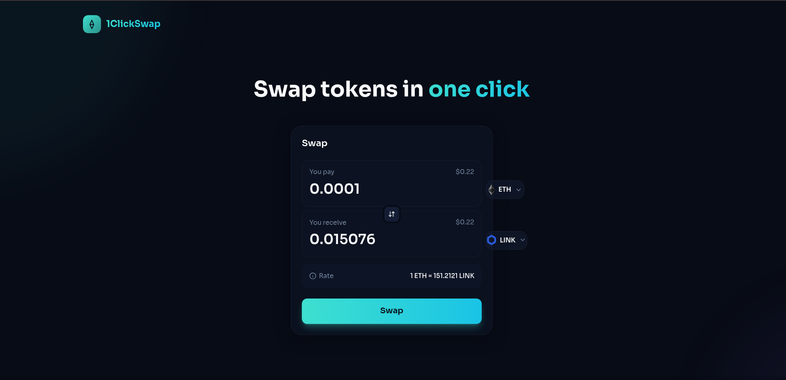
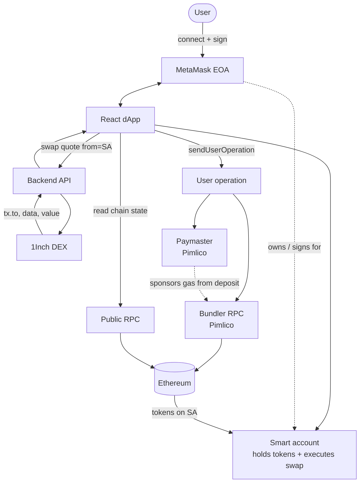
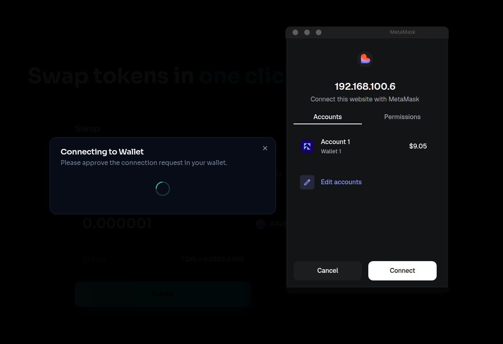
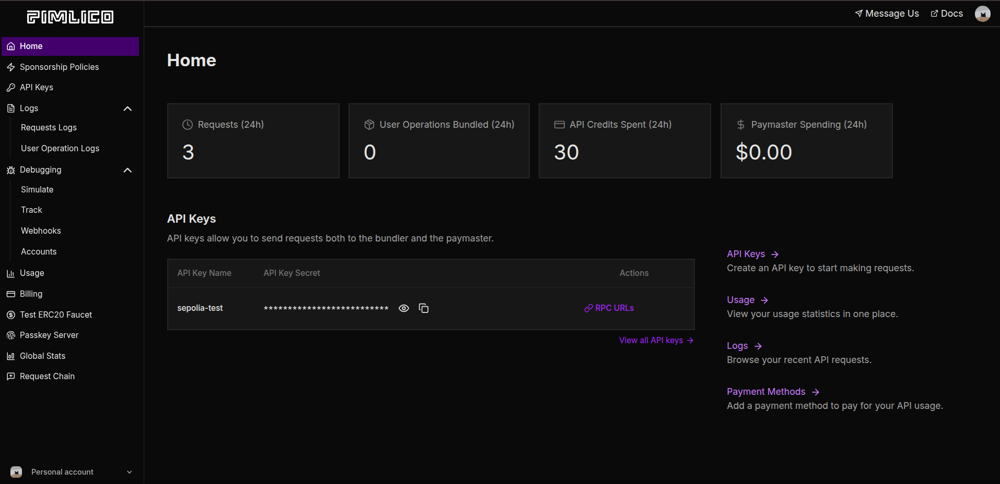
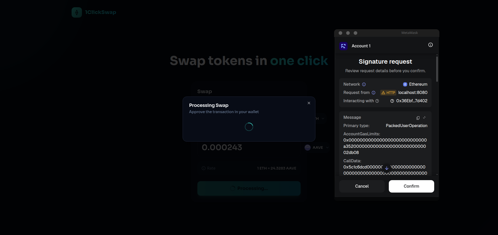
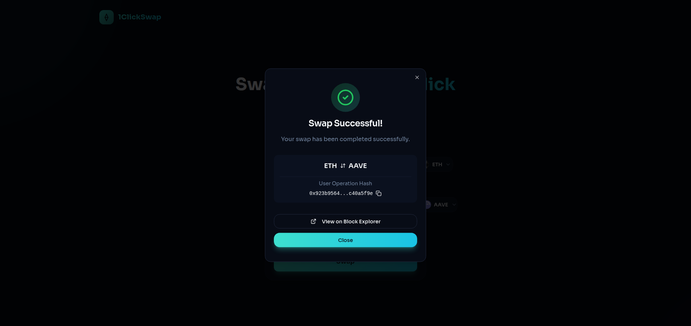

# Gasless swaps ETH-ERC20

> This project is a walkthrough of how sponsored transactions (EIP-4337) work on Ethereum, keeping the user experience as simple as possible.

## Table of Contents

- [Gasless swaps ETH-ERC20](#gasless-swaps-eth-erc20)
  - [Table of Contents](#table-of-contents)
  - [Introduction](#introduction)
  - [Gasless swap flow](#gasless-swap-flow)
    - [Architectural diagram](#architectural-diagram)
    - [How it works](#how-it-works)
    - [dApp - Connecting the wallet](#dapp---connecting-the-wallet)
    - [Gasless - Gas sponsorship](#gasless---gas-sponsorship)
    - [RPC - Interacting with the Blockchain](#rpc---interacting-with-the-blockchain)
    - [DEX - Getting the routing info](#dex---getting-the-routing-info)
    - [Smart account - EIP-4337](#smart-account---eip-4337)
    - [L2 and User Operations](#l2-and-user-operations)
    - [Executing the transaction](#executing-the-transaction)
  - [Local run](#local-run)

## Introduction

The objective is to build a "gasless" swap exchange for cryptocurrencies. The user connects their own wallet (EOA), selects a token, and signs one or more **user operations** (EIP-4337)—not a classic EOA transaction. The swap executes from a **smart account** derived from that wallet; received tokens land on the smart account address. The user does not pay ETH gas for execution because a paymaster sponsors it.

I will explain the theory, show a solution and demo, and describe how to run the project locally.

This works in mainnet and has been tested.



> There is no such thing as "gasless"—someone else always pays. There is no free lunch in any economic system that works and lasts over time.

## Gasless swap flow

The solution combines several mature tools to make this possible. "One-click" is the UX goal; on chain you may still sign multiple user operations (deploy, approve, swap). I stick to technology that is already battle-tested so I am not debugging obscure edge cases I barely understand. The goal is to ship an MVP for a real-world scenario—skin in the game.

Signing happens in the browser; a small backend only proxies DEX quotes so provider API keys stay off the client. That keeps secrets out of the frontend while the user still controls their wallet.

    We use:

- **React**: The default web stack today; I used Vite and generated the UI with [Lovable](https://lovable.dev). Design is not my strength (but I admire designers).

- **Gas**: Tokens required to process a transaction on chain

- **EIP-4337 (account abstraction)**: The standard that lets another party sponsor gas via a paymaster

- **Smart account**: A contract-backed account controlled by the EOA; the EOA still signs user ops in the browser, but execution and token balances live on the contract address

- **Web3 library**: Libraries that provide ergonomic helpers for wallet and chain integration

- **MetaMask**: The wallet I use most often 

### Architectural diagram

The following diagram shows the complete flow of a gasless swap transaction, including all the components and their interactions:



### How it works

1. The user connects their EOA to the dApp (e.g. MetaMask)

2. The user selects the token to swap—the **smart account** must hold enough of the source token (funds on the EOA alone are not enough unless already sent to the smart account)

3. For ERC-20 swaps, an **approve** or **permit** user operation may be required before the swap (the demo may skip this if allowance already exists)

4. The dApp fetches swap routing from 1inch, using the **smart account address** as `from`

5. The dApp builds the user operation with the Pimlico paymaster and bundler

6. The user signs the user operation(s) in the wallet

7. The dApp sends the user operation to the **bundler**; the paymaster sponsors gas from its **deposit** (no ETH gas from the user)

8. The bundler submits a bundle on chain; tokens are credited to the smart account

### dApp - Connecting the wallet

First things first: we need a bridge between the wallet and the browser so the dApp can interact with it. For that we use the [**wagmi**](https://wagmi.sh/) library, which provides primitives to connect to wallet providers such as MetaMask.



These hooks let us interact with the wallet through the browser:

```javascript
const { connectors, connect } = useConnect()
```

Then we check whether a wallet is already connected; if not, we take the first entry from the connectors array (in production you should let the user pick their wallet).

```javascript
if (!isConnected) {
    // Show connecting modal and connect wallet
    setShowConnectingWallet(true);
    setPendingSwapAfterConnect(true);

    const connector = connectors[0]; // Picks the first wallet
    if (connector) {
        await connect({ connector });
    }
}
```

Once connected, the wallet and the dApp can talk to each other.

### Gasless - Gas sponsorship

For gas sponsorship, someone else pays for execution (usually the dApp operator). Here we use [Pimlico](https://docs.pimlico.io/guides/getting-started), which provides a paymaster out of the box. You fund the paymaster deposit on Pimlico, and those funds are spent when sponsoring user operations.



    After that we can just use the client as it is:

```javascript
const pimlicoUrl = `https://api.pimlico.io/v2/1/rpc?apikey=${import.meta.env.VITE_PIMLICO_API_KEY}`

const paymasterClient = createPimlicoClient(
    {
        transport: http(pimlicoUrl),
        entryPoint: {
          address: entryPoint07Address,
          version: "0.7",
        },
    }
);
```

> **NOTE:** This should run on a backend, not in the frontend—unless you want everyone to spend your API key. :p

### RPC - Interacting with the Blockchain

We use two RPC endpoints for different jobs. A **public RPC** is for **reads**—balances, contract state, and building the smart account client. **User operations** are sent to **Pimlico's bundler RPC** (same API URL with your key), which validates, bundles, and lands the transaction on chain. Do not confuse the public node with the path that executes the swap.
    
For reads we use [https://eth.blockrazor.xyz](https://eth.blockrazor.xyz); many free endpoints are listed on [ChainList](https://chainlist.org/chain/1).

```javascript
const publicClient = createPublicClient(
    {
        chain: mainnet,
        transport: http("https://eth.blockrazor.xyz"),
    }
);
```

### DEX - Getting the routing info

To obtain swap routing on Ethereum mainnet, we need an aggregator. We use the [1inch](https://1inch.com/) API, which finds a competitive route across liquidity sources. Pass the **smart account address** as `from`, not the connected EOA.

**Example:** Swapping ETH for AAVE. The API returns the contract address to call, the value to send, and a `data` field with the ABI-encoded calldata the smart contract expects.
    
Amounts must be in the token's smallest unit (wei for ETH, token decimals for ERC-20). Keep them as `bigint`—do not use `Number()` on wei values.

```javascript
export async function getSwapData(fromAddress: string,tokenSrc: string, tokenDst: string, amount: string, permit?: string): Promise<SwapDataResponse | null> {
    const url = `${import.meta.env.VITE_API_URL}/dex/swap`
    try {
        const response = await axios.post<SwapDataResponse>(url, {
            "from": fromAddress,
            "tokenSrc": tokenSrc,
            "tokenDst": tokenDst,
            "amount": Number(parseEther(amount, "gwei")),
            "chainId": 1, // ETH mainnet
            "permit": permit || null,
        })
        return response.data
    }  catch (error) {
        console.error("[swap] Error swapping:", error)
        return null
    }
}
```

### Smart account - EIP-4337

As noted earlier, "gasless" only means someone else pays. Smart accounts make that practical: with a plain EOA you pay gas up front on every transaction. With a smart account, a paymaster can sponsor execution as part of the same user operation flow.
    
A smart account is a contract controlled by your main wallet (the EOA). It behaves like a sub-wallet that can run custom logic and batch calls. **Before swapping, the source token balance must be on the smart account address** (send or deposit from the EOA if needed). MetaMask may surface the smart account in its UI, but on chain the contract address is what 1inch and the paymaster see as `from`.

    First we define the Smart Account: 

- **public client**: Reads chain state from the RPC

- **Implementation**: Hybrid wallet + optional passkeys (overkill for this demo—I should have used `SingleDelegate`)

- **deployParams**: The EOA that owns the account; empty arrays reserve slots for passkeys

- **deploySalt**: Salt used when deriving the counterfactual address

- **signer**: The wallet client that signs user operations

```javascript
const smartAccount = await toMetaMaskSmartAccount(
    {
        client: publicClient,
        implementation: Implementation.Hybrid,
        deployParams: [ownerAddress, [], [], []],
        deploySalt: "0x", // Default
        signer: { walletClient },
    }
)
```

> Docs: [Account abstraction | ethereum.org](https://ethereum.org/roadmap/account-abstraction/)

### L2 and User Operations

Account abstraction (EIP-4337) batches work as **user operations** instead of one EOA transaction per click. A bundler validates and submits them; a paymaster can sponsor gas. L2s add cheaper execution, but the gasless flow here is the 4337 stack (paymaster + bundler).
    
To send a user operation we wire up the smart account client with:

- **paymaster**: The contract/service that sponsors gas from its deposit (or, in token-paymaster setups, charges the user in ERC-20 instead of ETH)

- **bundler**: The node that validates user operations, bundles them, and submits the resulting transaction on chain

- **estimateFeesPerGas**: Priority fee selection; here we use Pimlico's `fast` tier. Fees depend on gas limits and current network conditions

```javascript
const smartAccountClient = createSmartAccountClient(
    {
        account: smartAccount,
        chain: mainnet,
        paymaster: paymasterClient,
        bundlerTransport: http(
          pimlicoUrl,
        ),
        userOperation: {
          estimateFeesPerGas: async () =>
            (await paymasterClient.getUserOperationGasPrice()).fast,
        },
    }
);
```
### Executing the transaction

With the smart account client and swap quote ready, we fill in the call. The `data` field from 1inch is the encoded calldata; the client attaches paymaster and bundler settings from the previous step. For ERC-20 sells you typically need a prior **approve** user operation (or an EIP-2612 **permit** in the 1inch request) so the router can pull tokens from the smart account.

After `sendUserOperation`, the bundler includes it in a bundle, the paymaster covers gas from its deposit, and we get back a **user operation hash**. `waitForUserOperationReceipt` confirms the op was included. On Etherscan you usually inspect the **bundled on-chain transaction** hash (EntryPoint), not the userOp hash alone.

```javascript
const swapResponse = await getSwapData(
    smartAccount.address, 
    fromToken?.address, 
    toToken?.address, 
    fromAmount
);

const swapHash = await smartAccountClient.sendUserOperation(
    {
        account: smartAccount,
        calls: [{
          to: swapResponse?.tx.to as Hex,
          data: swapResponse?.tx.data as Hex,
          value: BigInt(swapResponse?.tx.value ?? 0),
        }]  
    }
)

// After a few seconds we receive the user operation receipt
const swapReceipt = await smartAccountClient.waitForUserOperationReceipt({ hash: swapHash });
```





Example **bundled on-chain transaction** (Etherscan): [0x00e35ea9209741cbf5aedcb4f644bd970d0b8fa62060001110badeab9b3cb125](https://etherscan.io/tx/0x00e35ea9209741cbf5aedcb4f644bd970d0b8fa62060001110badeab9b3cb125)

## Local run

The code was written quickly for a challenge and **is not production quality by any means**.

1. Clone the repo https://github.com/bizk/ERC20-gasless-swap

2. Get API keys from the providers
   
   1. 1inch for swap routing
   
   2. Pimlico for gasless sponsorship

3. Set up the **server**
   
   1. `cd server`
   
   2. Run `npm i`
   
   3. Set up 1inch key as `export INCH_TOKEN=abc....`
   
   4. Run the server `npm run start`

4. Set up the **web dApp**
   
   1. `cd web`
   
   2. Run `npm i --legacy-peer-deps`
   
   3. Set up the .env
      
      ```shell
      VITE_PIMLICO_API_KEY=pim_xxx
      VITE_API_URL=http://localhost:3000
      # Optional: only for experimental delegator path in the repo, not the main MetaMask swap flow
      # VITE_PRIVATE_KEY=0x...
      ```
      
      The 1inch API key lives on the **server** as `INCH_TOKEN` (step 3)—not in the web `.env`.

5. Run the web app: `npm run dev`
